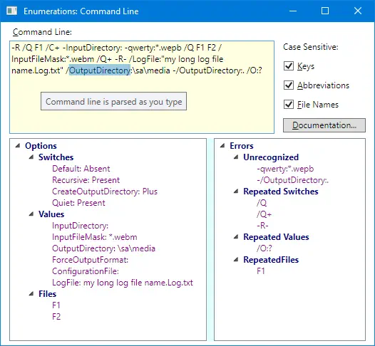

# Enumerations

Really enumerating .NET enumeration type + enumeration-based command line

Covered topics:

* Generic Enumeration type
* Command-line utility based on <code>enum</code> declarations
* Localization
* Automatically generated documentation

## Publications

* [Enumeration Types do not Enumerate! Working around .NET and Language Limitations](https://www.codeproject.com/Articles/129830/Enumeration-Types-do-not-Enumerate-Working-around)
* [Human-readable Enumeration Meta-data](https://www.codeproject.com/Articles/136181/Human-readable-Enumeration-Meta-data)
* [Enumeration-based Command Line Utility](https://www.codeproject.com/Articles/144349/Enumeration-based-Command-Line-Utility)
* [Bitwise Enumeration Editor for PropertyGrid and Visual Studio](https://www.codeproject.com/Articles/809357/Bitwise-Enumeration-Editor-for-PropertyGrid-and-Vi)
* Modernized .NET Enumerations and Command Line (under developement)

## Under development

